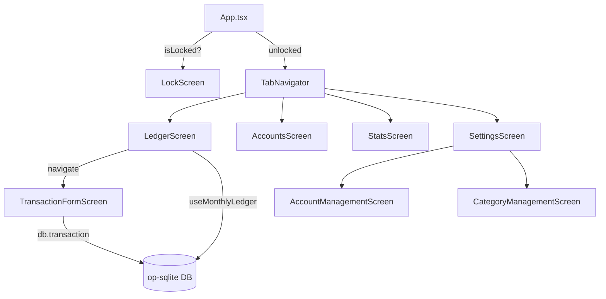

# Pocket Log – Architecture Documentation

## Overview

Pocket Log is a **React Native** mobile application for iOS and Android. The app records personal financial transactions (expenses, incomes, transfers), categorizes them using a 3-level hierarchy, and provides a polished monthly ledger view with balance carry-forward capabilities.

### Core Technology Stack

| Layer | Technology |
|---|---|
| **UI Framework** | React Native 0.84 (TypeScript) |
| **Navigation** | React Navigation 7 (Native Stack + Bottom Tabs) |
| **Database** | `op-sqlite` + Drizzle ORM |
| **State Management** | Zustand |
| **Security** | `react-native-keychain` + `react-native-biometrics` |
| **Visual Effects** | `@react-native-community/blur` (Frosted Glass) |
| **Branding** | `react-native-bootsplash` (Splash) + `react-native-make` (Icons) |
| **File System** | `react-native-fs` (export/import file I/O) |
| **Data Transfer** | `xlsx` (CSV/XLSX generation & parsing) + `react-native-document-picker` (file selection) |

---

## Directory Structure

```
src/
├── App.tsx                    # Root component (auth gate + navigation)
├── android/                   # Android native project
├── ios/                       # iOS native project
├── assets/                    # Static assets (brand logos, splash)
├── Gemfile                    # Bundler config — pins cocoapods version
└── src/
    ├── core/                  # Shared utilities and design system
    ├── database/              # ORM schema, migrations, seed
    ├── features/              # Feature modules (auth, ledger, transaction, settings)
    ├── navigation/            # Tab and Stack navigators
    └── stores/                # Zustand global state stores
```

---

## `src/core/` – Shared Core Layer

The core layer provides the shared design system and cross-feature utilities.

```
src/core/
├── constants/
│   ├── appConfig.ts           # APP_NAME, APP_NAME_SLUG, APP_VERSION, APP_BUNDLE_ID
│   ├── enums.ts               # Enum definitions (SettingsKey, TransactionType, etc.)
│   ├── defaults.ts            # App-level constants (MAX_CATEGORY_DEPTH, CURRENCIES, etc.)
│   ├── seed.ts                # Seed data definitions
│   └── index.ts               # Barrel export
├── theme/
│   ├── colors.ts              # Light/Dark color tokens (Navy Blue / Medium Blue accent)
│   ├── presets.ts             # Shared style presets (LedgerRowDensityPreset,
│   │                          #   LedgerTextHierarchyPreset, LedgerSummaryCardMetricsPreset,
│   │                          #   FormHeaderPreset)
│   └── index.ts               # useAppTheme() hook + barrel export
└── utils/
    ├── currency.ts            # Currency formatting
    ├── date/                  # getMonthRange(), groupByDay(), etc.
    ├── exportData.ts          # createExportPayload() — writes CSV/XLSX to RNFS temp dir
    ├── importData.ts          # importDataFromFilePath(), createImportTemplatePayload()
    ├── accountRules.ts        # isClosedBoxLikeAccount(), isMandatoryClosedBoxType(),
    │                          #   isDebtType(), normalizeInitialBalanceByType()
    └── index.ts               # Barrel export
```

### Key Patterns
- **iOS Aesthetic**: Off-white background (`#F5F5F7`), navy blue primary accents (`#1B3A5C` light / `#2568c5` dark), squircle-rounded cards (iOS Settings-style) for lists.
- **Theme Hook**: `useAppTheme()` provides reactive access to the user's selected theme (Light/Dark/System).
- **Style Presets**: Shared tokens in `presets.ts` enforce visual consistency across screens:
  - `LedgerRowDensityPreset` — row `paddingVertical`/`paddingHorizontal` and separator thickness
  - `LedgerTextHierarchyPreset` — primary, secondary, amount, and meta text styles
  - `LedgerSummaryCardMetricsPreset` — summary card padding
  - `FormHeaderPreset` — management/form screen title font
- **Sub-item Left-Border**: Reserve accounts and sub-categories are visually indented using `borderLeftWidth: 2, borderLeftColor: theme.primary` (visible in both Light and Dark themes).

---

## `src/database/` – Database Layer

```
src/database/
├── index.ts                   # DB initialization & migrations
├── schema.ts                  # Drizzle ORM tables
├── seed.ts                    # Default set of accounts and categories
└── migrations/                # Versioned SQL migrations
```

### Schema Tables

| Table | Purpose | Key Columns |
|---|---|---|
| `accounts` | User bank/cash accounts | `name`, `type`, `isActive`, `parentId`, `excludeFromSummaries`, `settlementDay`, `sortOrder` |
| `categories` | 3-level hierarchy | `name`, `iconName`, `parentId` |
| `transactions` | Ledger entries | `amount`, `type`, `date`, `linkedTransactionId` |
| `appSettings` | Key-value store | `key`, `value` |

### Feature: Opt-Out Accounts & Nested Reserves
Accounts support 1-level deep nesting (Reserves) and custom grouping. Accounts marked `excludeFromSummaries` (**Opt Out**) are excluded from the monthly income/expense totals. Direct income/expense transactions can still be recorded on opt-out accounts. Special ledger logic ensures transfers *to* an opt-out account count as expenses in the global view, while transfers *from* an opt-out account count as income. In an account-filtered ledger view, transfers are shown from that account's own perspective (credits = income, debits = expense).

### Feature: Account Settlement Day
Card-type accounts have a `settlementDay` field (1–28, default **10**). The value is clamped to `Math.min(28, ...)` on save. The field is only shown in the account form when the account type is `CARD`. The account balance SQL uses `settlementDay` to compute the current billing-cycle balance vs the previous billing-cycle balance for card accounts.

### Feature: Carry Forward Balance
When enabled, the ledger hook queries all transactions prior to the current month to calculate an opening balance, which is then injected as a virtual row in the ledger.

---

## `src/features/` – Feature Modules

```
src/features/
├── auth/
│   └── screens/LockScreen.tsx          # PIN/Biometric gate
├── ledger/
│   ├── components/
│   │   ├── MonthSelector.tsx           # Compact month nav
│   │   ├── MonthlySummary.tsx          # Top summary stats
│   │   └── TransactionItem.tsx         # Ledger row renderer
│   ├── hooks/useMonthlyLedger.ts       # Data fetching & carry-forward logic
│   └── screens/LedgerScreen.tsx        # Unified Bubble (Selector + Summary) + List
├── accounts/
│   ├── hooks/useAccountsSummary.ts     # SQL-driven account summary aggregation
│   └── screens/AccountsScreen.tsx      # Accounts summary with reserves (left-border indent)
├── transaction/
│   ├── components/
│   │   ├── AccountPicker.tsx           # Grouped account selection
│   │   ├── CategoryPicker.tsx          # Hierarchical picking
│   │   └── DatePicker.tsx              # @react-native-community/datetimepicker
│   └── screens/TransactionFormScreen.tsx  # Dynamic form (Expense/Income/Transfer)
└── settings/
    ├── components/
    │   └── PinSetupModal.tsx             # Full-screen PIN entry (setup: enter+confirm / verify: enter+validate)
    └── screens/
        ├── SettingsScreen.tsx           # Preferences, currency/theme pickers with selection highlight;
        │                                #   SECURITY section (App Lock, Biometrics, Change PIN);
        │                                #   export (CSV/XLSX), import (CSV/XLSX), cloud backup
        ├── AccountManagementScreen.tsx  # CRUD for accounts; collapsible type sections, left-border reserves
        ├── AccountFormScreen.tsx        # Add/Edit account form
        └── CategoryManagementScreen.tsx # CRUD for categories; collapsible sections, left-border sub-categories
```

---

## Export / Import

### Export
- **`createExportPayload(format: 'csv' | 'xlsx')`** queries all four tables, builds an XLSX workbook, writes it to `RNFS.TemporaryDirectoryPath`, and returns `{ filename, filePath }`.
- **CSV** export contains only the Transactions sheet; **XLSX** export contains Transactions, Accounts, Categories, and Settings sheets.
- The caller shares the file via `Share.share({ url: 'file://...' })` (iOS native share sheet — Save to Files, AirDrop, email, etc.).

### Import
- **`importDataFromFilePath(filePath)`** reads the file with `RNFS.readFile(path, 'base64')` and passes it to `XLSX.read`. This is reliable for `file://` URIs from `react-native-document-picker`.
- If the workbook contains only a Transactions sheet → **append mode**: transactions are added to existing accounts/categories by name lookup.
- If Accounts, Categories, or Settings sheets are present → **replace mode**: all existing data is deleted and fully replaced within a single DB transaction.
- **`createImportTemplatePayload(format)`** generates a blank template workbook (sample row per sheet) and writes it to the temp dir for sharing.
- Template download is accessible via the **Import Data** settings row → Alert: "Import File / Download Template / Cancel".

### CocoaPods
Use `bundle exec pod install` (not bare `pod install`) — the project pins cocoapods via `Gemfile` installed into `vendor/bundle`.

---

## Navigation Architecture

The app uses a hybrid navigation structure:
1. **RootStack**: Manages top-level screens and modal forms.
2. **MainTabs**: 4-tab bottom navigator (Ledger, Accounts, Stats, Settings).

---

## `src/stores/` – Global State

- **`authStore`**: Manages app locking, session state, and biometrics.
  - PIN stored in `react-native-keychain` (service: `'app_pin'`).
  - Biometrics enabled flag stored in `AsyncStorage`.
  - `initialize()`: if PIN found in keychain → `isLocked: true`; otherwise `isLocked: false` (auth is off by default).
  - `lockApp()`: only locks if a PIN is set — no PIN means the app never locks.
  - `unlockWithBiometrics()`: uses Keychain `ACCESS_CONTROL.BIOMETRY_CURRENT_SET` to trigger Face ID / Touch ID before returning the stored PIN.
  - Auth is **off by default** — users opt-in via Settings → Security → App Lock.
- **`ledgerStore`**: Tracks the currently viewed month and triggers refreshes.

---

## Data Flow Diagram


