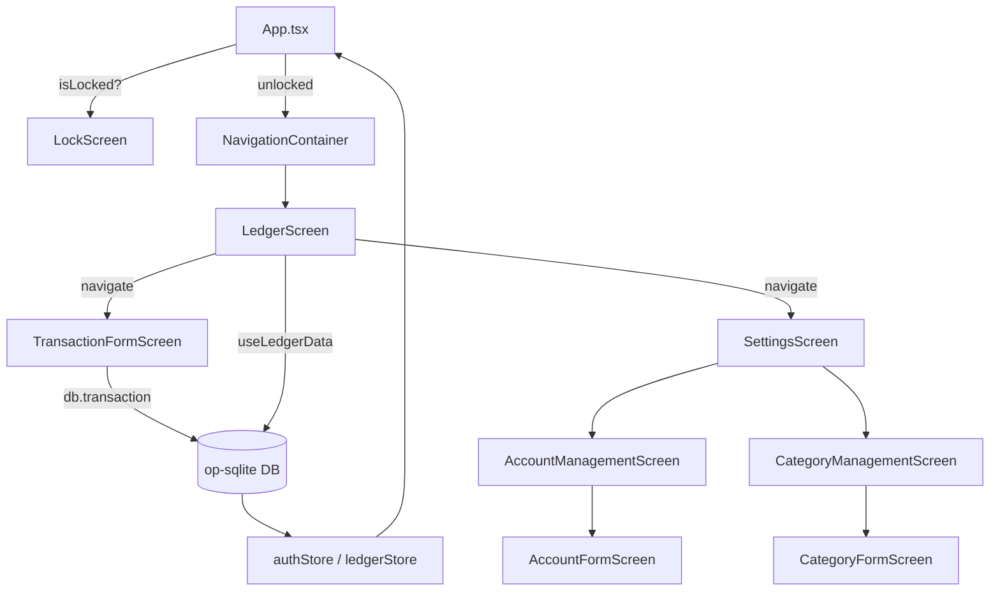

# PiggyBook – Architecture Documentation

## Overview

PiggyBook is a **React Native** mobile application targeting iOS and Android. The app records personal financial transactions, categorizes them, and provides a monthly ledger view.

### Core Technology Stack

| Layer | Technology |
|---|---|
| **UI Framework** | React Native 0.84 (TypeScript) |
| **Navigation** | React Navigation 7 (Native Stack) |
| **Database** | `op-sqlite` + Drizzle ORM |
| **State Management** | Zustand |
| **Security** | `react-native-keychain` + `react-native-biometrics` |
| **Visual Effects** | `@react-native-community/blur` |
| **Splash Screen** | `react-native-bootsplash` |

---

## Directory Structure

```
d:/Projects/money_manager/
├── App.tsx                    # Root component (auth gate + navigation)
├── android/                   # Android native project
├── ios/                       # iOS native project
├── assets/                    # Static assets (bootsplash logos)
└── src/
    ├── core/                  # Shared utilities and design system
    ├── database/              # ORM schema, migrations, seed
    ├── features/              # Feature modules (auth, ledger, transaction, settings)
    ├── navigation/            # Root navigator definition
    └── stores/                # Zustand global state stores
```

---

## `src/core/` – Shared Core Layer

The core layer provides the shared design system and cross-feature utilities.

```
src/core/
├── constants/
│   ├── enums.ts               # Enum definitions (AccountType, TransactionType, CategoryType)
│   ├── defaults.ts            # App-level defaults (currency symbol, date format)
│   ├── seed.ts                # Seed data definitions for accounts/categories
│   └── index.ts               # Barrel export
├── theme/
│   ├── colors.ts              # Full light & dark palette definition
│   └── index.ts               # useAppTheme() hook (returns theme, colors, isDark)
└── utils/
    ├── currency.ts            # formatCurrency() helper
    ├── dateHelpers.ts         # groupByDay(), isWeekend(), toDateStr()
    └── index.ts               # Barrel export
```

### Key Patterns
- **`useAppTheme()`** — Custom hook wrapping `useColorScheme()`. Returns `{ theme, colors, isDark }`. `theme` is the current dark/light object; `colors` is an always-accessible palette (e.g. `colors.primary`, `colors.expense`, `colors.income`).
- **Enums** — All type discriminators (`TransactionType.EXPENSE`, `AccountType.BANK`) are exported from `constants/enums.ts` to be used throughout the app.

---

## `src/database/` – Database Layer

```
src/database/
├── index.ts                   # Opens op-sqlite DB, runs migrations, exports `db`
├── schema.ts                  # Drizzle ORM table definitions
├── seed.ts                    # Seeds default accounts and categories on first run
└── migrations/                # Drizzle SQL migration files
```

### Schema Tables

| Table | Purpose | Key Columns |
|---|---|---|
| `accounts` | User bank/cash accounts | `name`, `type`, `initialBalance`, `isActive` |
| `categories` | Hierarchical categories (3 levels) | `name`, `iconName`, `type`, `parentId`, `level` |
| `transactions` | Every financial transaction | `amount`, `type`, `accountId`, `categoryId`, `date`, `linkedTransactionId` |
| `app_settings` | Key-value settings store | `key`, `value` (JSON string) |

### Transfer Logic
Transfers create **two linked transaction records** (debit & credit) in a single Drizzle `db.transaction()` call, linked via `linkedTransactionId`. Deleting either side of a transfer atomically removes both records.

---

## `src/features/` – Feature Modules

Each feature follows the **screens / components / hooks** pattern:

```
src/features/
├── auth/
│   └── screens/LockScreen.tsx          # 4-digit PIN pad + biometrics unlock screen
├── ledger/
│   ├── components/
│   │   ├── MonthSelector.tsx           # Prev/Next month navigator
│   │   ├── SummaryCard.tsx             # Income / Expense / Net for the month
│   │   └── TransactionRow.tsx          # Single row in a day section
│   ├── hooks/useLedgerData.ts          # Fetches and groups transactions by day
│   └── screens/LedgerScreen.tsx        # Main screen: month + summary + SectionList
├── transaction/
│   ├── components/
│   │   ├── AccountPicker.tsx           # Modal list of accounts to select
│   │   ├── CategoryPicker.tsx          # Hierarchical 3-level category modal
│   │   └── MonthPicker.tsx             # Custom iOS-style month/year grid picker
│   └── screens/TransactionFormScreen.tsx  # Add/Edit form (expense, income, transfer)
└── settings/
    └── screens/
        ├── SettingsScreen.tsx           # Hub: preferences, entity links, export
        ├── AccountManagementScreen.tsx  # List of all user accounts
        ├── CategoryManagementScreen.tsx # Indented 3-level category list
        ├── AccountFormScreen.tsx        # Add/Edit account form
        └── CategoryFormScreen.tsx      # Add/Edit category form (with parent picker)
```

### Feature Design Principles
- **No cross-feature imports** — Features do not import from each other directly. Shared state is through stores.
- **Data access inside screens** — Direct `db.*` queries are made from screen components for simplicity in M1. A repository pattern will be introduced in M2.
- **Modal presentation** — All forms use `transparentModal` + `@react-native-community/blur` to render a frosted-glass effect over the screen below, creating a Liquid Glass aesthetic on iOS.

---

## `src/navigation/` – Navigation

```
src/navigation/
└── RootNavigator.tsx
```

`RootNavigator` is a single `NativeStack`, with these screens:

| Route | Component | Presentation |
|---|---|---|
| `Ledger` | `LedgerScreen` | Default (push) |
| `TransactionForm` | `TransactionFormScreen` | `transparentModal` |
| `Settings` | `SettingsScreen` | Default (push) |
| `AccountManagement` | `AccountManagementScreen` | Default (push) |
| `CategoryManagement` | `CategoryManagementScreen` | Default (push) |
| `AccountForm` | `AccountFormScreen` | `transparentModal` |
| `CategoryForm` | `CategoryFormScreen` | `transparentModal` |

`RootStackParamList` is exported from this file so screens can be typed with `NativeStackScreenProps<RootStackParamList, 'RouteName'>`.

---

## `src/stores/` – Global State (Zustand)

```
src/stores/
├── authStore.ts    # isLocked, PIN management, biometrics, lockApp()
└── ledgerStore.ts  # selectedMonth, refresh() trigger for ledger re-fetch
```

### `authStore`
Manages the entire security lifecycle:
1. On app start → `initialize()` reads PIN from Keychain; if found, `isLocked = true`.
2. On background → `lockApp()` sets `isLocked = true`.
3. LockScreen calls `unlockWithPin(pin)` or `unlockWithBiometrics()` to unlock.
4. PIN is stored securely in `react-native-keychain` under the `app_pin` service key.

### `ledgerStore`
A lightweight store holding the currently visible `selectedMonth` (ISO string) and a `refresh()` function that increments a counter, triggering `useLedgerData` to re-fetch after any transaction mutation.

---

## `App.tsx` – Entry Point

```
App.tsx
  ├── initDatabase()          ← runs schema migrations + seed
  ├── authStore.initialize()  ← reads PIN from keychain
  ├── RNBootSplash.hide()     ← dismisses native splash screen
  ├── AppState listener       ← locks on background
  └── Render:
      - if isLocked  → <LockScreen />
      - else         → <NavigationContainer><RootNavigator /></NavigationContainer>
```

---

## Data Flow Diagram


